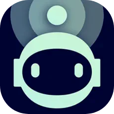
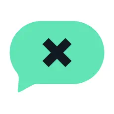

### Hello, I am Dominik👋

I am an iOS developer with a track record dating back to 2017, specialized in creating applications with sleek and user-friendly interfaces. 
Deeply passionate about Swift, consistently exploring new opportunities to broaden expertise within the iOS platform.

### Projects I worked on

<b>Robokiller</b>

  

     
    
    

      <b>Robokiller</b> is an app designed to block spam calls and telemarketers. It uses <b>machine learning</b> to <b>identify</b> and <b>filter out</b> unwanted calls in real-time. 
      The app also offers features like <b>personalized block and allow lists</b>, <b>SMS spam filtering</b>, and the ability to play <b>pre-recorded answer bots</b> to waste spammers' time. 
      It's known for its effectiveness in <b>reducing unwanted calls</b> and <b>improving call management</b> on iPhones.
    

  

<b>Textkiller</b>

  

     
    
    

      <b>Textkiller</b> is an app designed to block spam texts. It uses <b>machine learning</b> to <b>analyse</b> and <b>categorise</b> text messages in real-time. 
      The app also offers features like <b>personalized block and allow lists</b>, allowing users to add <b>phone numbers</b>, <b>keywords</b>, and <b>sender names</b> to the filter list. 
      It has a <b>99% accuracy</b> in <b>identifying</b> and <b>filtering</b> spam texts.
    

  

<b>Glooko</b>

  

     
    
    

      <b>Glooko</b> is an iOS app designed to help people <b>manage their diabetes</b> more effectively. It allows users to <b>track their blood glucose levels</b>, <b>medication intake</b>, <b>food consumption</b>, and <b>physical activity</b>. 
      The app also offers features like <b>insulin dose tracking</b>, <b>data analysis</b>, and the ability to <b>share information with healthcare providers</b>. 
      App aims to empower individuals with diabetes to <b>better understand their condition</b> and <b>make informed decisions</b> about their health.
    

  

### Tools of the trade

### Contact

&nbsp;
&nbsp;
